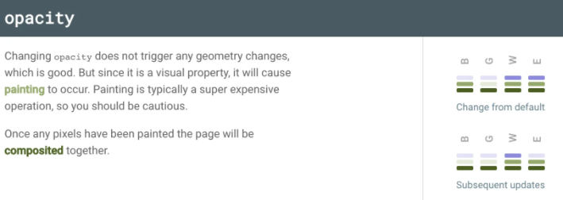

# CSS Transformations and Transitions

## Propiedades recomendadas y no recomendadas para animar

Al hacer animaciones debemos fijarnos que no sean demasiado costosas computacionalmente para que no parezcan inestables y poco fluidas.

Para ello, debemos comprender un concepto clave llamado: el proceso de renderizado.

Resulta que, como el navegador no entiende el código que hacemos, debe hacer una transformación de ese código para que finalmente pueda ser entendido y visualizado en la pantalla.

Esa transformación se hace en una serie de pasos como los que puedes ver a continuación:

Sin embargo, los pasos que nos interesan en este momento son los últimos 3: Layout, Paint y Composite. Cada uno cumple un papel muy importante, pero no todas las propiedades pasan por estos 3 procesos.

Si una propiedad debe pasar por el paso de Layout, obligatoriamente debe pasar por Paint y Composite también. Si una propiedad debe pasar por el paso de Paint, obligatoriamente debe pasar por Composite también. Pero, si una propiedad debe pasar por el paso de Composite, no debe pasar por ningún otro paso.

Con lo anterior, podemos darnos cuenta de que hay propiedades que requieren un costo mayor que otras al tener que pasar por más pasos. Puedes revisar el proceso de renderizado que realiza cada propiedad en esta página: https://csstriggers.com/. Revisemos algunas de ellas:

- **Propiedad height:** En cada uno de los motores de renderizado, podemos darnos cuenta por la imagen de abajo que requiere de los pasos de Layout, Paint y Composite, lo cual es bastante costoso.

- **Propiedad background-color:** Es una propiedad que no afecta el diseño (Layout) pero requiere una nueva capa de pintura (Paint), lo cual la hace una propiedad también costosa.

- **Propiedades transform y opacity:** Estas dos propiedades sólo requieren del paso de Composite, lo cual las hace muy baratas de animar. Si necesitas modificar propiedades como width y left (propiedades costosas), puedes reemplazarlas usando la propiedad transform para tratar de lograr el mismo efecto.

Finalmente, si sabemos por cuáles pasos de renderizado pasa cada una de las propiedades, sabremos con exactitud cuáles propiedades son más costosas y menos recomendadas para animar (como height, width y background-color), como también, cuáles propiedades son menos costosas y más recomendadas para animar (como transform y opacity).

Te comparto esta lectura por si quieres conocer más a profundidad cómo trabaja el motor de cada navegador con cada uno de los pasos que describimos anteriormente: https://hacks.mozilla.org/2017/08/inside-a-super-fast-css-engine-quantum-css-aka-stylo/